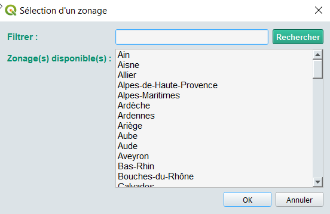
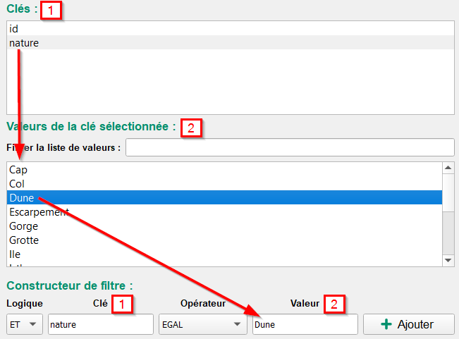

# MANUEL UTILISATEUR


## Interface de Connexion

Afin d’accéder aux différentes fonctionnalités du plugin, il faut d’abord vous connecter à votre base de données Geonature.
Dans le menu ``Geonature - GIS``, cliquer sur “**Connexion**”. 


Une fenêtre s’ouvre dans laquelle il vous faudra renseigner les informations suivantes : 
 - Nom de **hôte** du serveur Geonature
 - Numéro du **port** du serveur
 - Nom de la **base de données**
 - Votre **nom d'utilisateur**
 - Votre **mot de passe**


>À noter : Les **informations de connexion** et le **nom d'utilisateur** seront sauvegardés pour les prochaines sessions, cependant le **mot de passe** sera demandées à chaque nouvelle session QGIS.<br/>
*Les informations de connexion restent toutefois modifiables si besoin.*

La connexion validée, vous avez maintenant accès aux outils **référentiel géographique** et **exports** !


## Fenêtre du référentiel géographique

Dans le menu ``Geonature - GIS``, cliquer sur “**Référentiel géographique**”.

Le panneau latéral suivant s'ouvre : 


### Bouton aide


### Bouton Réinitialisation

Il permet de remettre l'ensemble des paramètres saisis à zéro.


### Sélection du type de zonage


La **sélection du type de zonage** vous permet de sélectionner le ou les types de zonages que vous souhaitez filtrer et/ou exporter. Il s’agit du **seul paramètre** qu’il est **obligatoire** de renseigner.

*Un texte descriptif  “**Type(s) de zonage(s) sélectionné(s)**” se mettra à jour en conséquence lors de votre sélection afin de conserver une visibilité sur celle-ci.*

```
    Attention ! Pour une nouvelle sélection, si des filtres ont été déjà paramétrés, cliquez sur le bouton de Réinitialisation.
```

### Filtrer le type de zonage
Après avoir sélectionner un type de zonage, vous avez la possibilité d’y ajouter un filtre.


Ce bouton vous ouvrira une nouvelle fenêtre qui listera les zonages disponibles pour le type sélectionné. 
 
>Nous prendrons le type de zonage "Départements - surface" pour vous donner un exemple concret d'utilisation.



Vous allez pouvoir renseigner dans la barre de recherche "**Filtrer**" le nom du/des zonages qui vous intéresse afin de filtrer cette liste. 

```
    Attention : Les zonages se trieront uniquement lors du click sur le bouton “Rechercher”.
```

>Par exemple, si vous recherchez le département "Charente-Maritime" :


Pour sélectionnner votre ou vos zonage(s), cliquez sur son nom.

Une fois que votre sélectionne est terminée, cliquez sur "OK".


### Sélection d'une source

Vous pouvez choisir la **source** de votre donnée si vous en avez la connaissance.


>Cliquez sur la flèche du menu déroulant pour voir s'afficher les sources de votre type de zonage.

*Un texte descriptif “source(s) trouvée(s)” se mettra à jour lors de votre sélection en comptabilisant le nombres de sources sélectionnées.*


### Paramètres avancés

Les paramètres avancés sont destinés à des utilisations spécifiques. Actuellement, ils contiennent le filtre sur les **géométries active dans Geonature** qui vous permet de filtrer le champ ``enable``.


>Cocher "Oui" pour sélectionner les géométries actives dans Géonature dans votre filtre, "Non" pour les inactives et laisser "Indiférent" si vous ne souhaitez pas filtrer ce champs.


### Filtre - Données additionnelles


Le bouton **Filtre – Données Additionnelles** vous redirige vers une nouvelle fenêtre dans laquelle vous pourrez filtrer le champ ``additional_data``.

*Sous ce bouton, un texte descriptif se mettra à jour lors de la validation du paramétrage de votre filtre.*

```
    Un message "Pas de données additionnelles trouvées" apparaît s'il y a pas de données pour le type de zonage sélectionné.
```


La fenêtre affichera les **clés** de ce champ. Vous pouvez choisir la clé dont vous avez besoin en cliquant dessus. Cela l'incrira dans le **Constructeur de filtre** et affichera dans l'espace "**Valeurs de la clé sélectionnée**" la liste des valeurs présentes dans cette clé. Il vous est possible de trier ces valeurs avec le champ de recherche "**Filtrer le liste de valeurs**" Pour sélectionner une valeur, double-cliquez dessus. Celle-ci ira s'inscrire dans le **Constructeur de filtre**.




>Le **Constructeur de filtre** peut également être entièrement renseigné à la main.


Vous aurez donc les valeurs de la clé sélectionnée qui apparaîtront en dessous, il est possible de rechercher la valeur souhaitée dans la barre de recherche des valeurs.
Vous allez donc pouvoir construire votre filtre avec un ET/OU, le nom du champ que vous aurez sélectionné, un opérateur, et le nom de la valeur que vous aurez sélectionnée. 